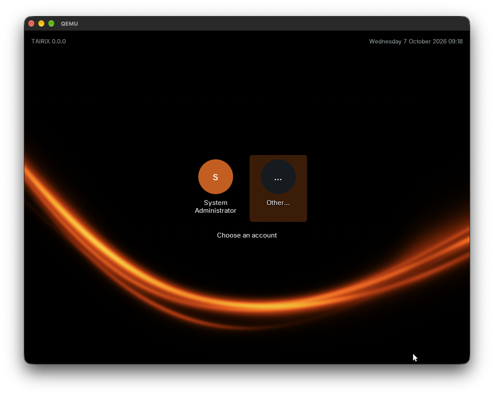
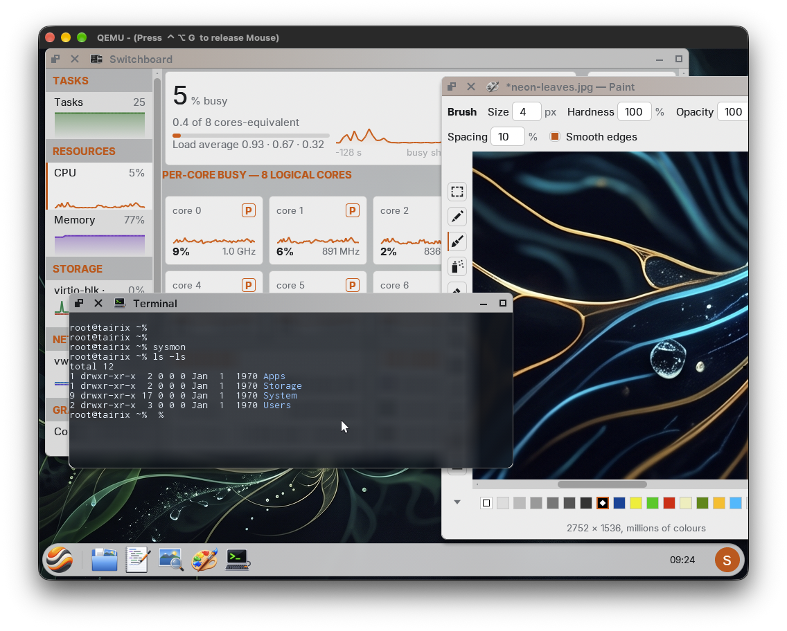
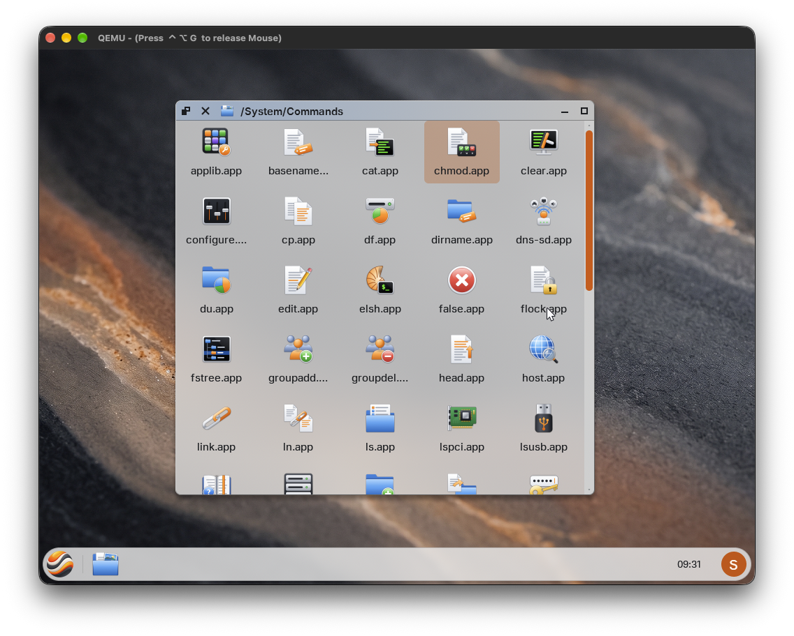
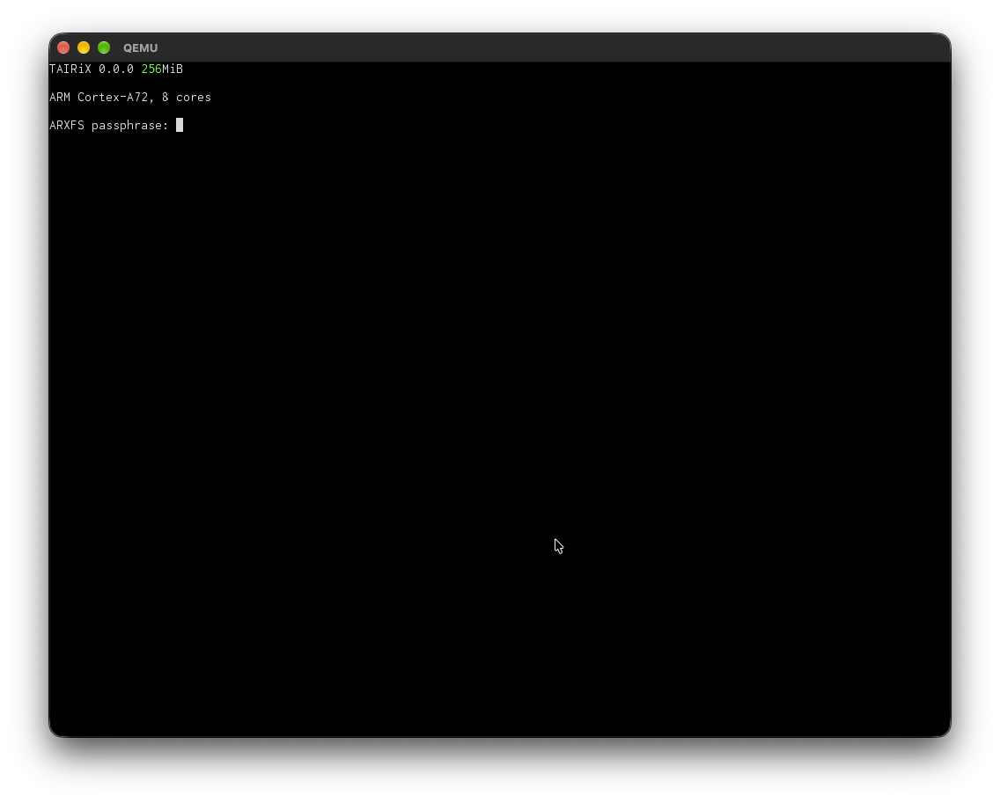

# TAIRiX /'taɪ.rɪks/ - An exploration of practical operating system design

A security-first, multi-user, multi-core operating system written in Rust,
targeting bare-metal x86_64, AArch64, RISC-V 64, and the browser via wasm32. TAIRiX is _not_ Linux.

This file is intentionally brief. Authoritative documents live alongside the
code:

- [`AGENTS.md`](./AGENTS.md) — binding engineering charter.
- [`PLAN.md`](./PLAN.md) — staged delivery plan.
- [`docs/`](./docs) — long-form architecture, security, and platform book
  (built with mdBook).

## Status
**Work in progress.** - There is a long way to go before this project is ready
for prime time, if it ever will be. <span style="color:red">**Do not expect anything to work yet, Do *not* use it.**</span>

## Screenshots

Here are some screenshots of TAIRiX running, showcasing the current state of the project 
<table>
  <tr>
    <td align="center"><a href="docs/screenshots/desktop-login.png"></a><br><sub>Desktop Login Screen</sub></td> 
    <td align="center"><a href="docs/screenshots/basic-desktop.png"></a><br><sub>The desktop</sub></td>
    <td align="center"><a href="docs/screenshots/filemanager.png"></a><br><sub>File manager PoC</sub></td>
    <td align="center"><a href="docs/screenshots/switchboard.png"></a><br><sub>Switchboard (task&nbsp;manager)</sub></td>
</tr>
  <tr>
    <td align="center"><a href="docs/screenshots/transparency-blur-compositor.png"></a><br><sub>Compositor with transparency/blur support</sub></td>
    <td align="center"><a href="docs/screenshots/boot-filesystem-unlock.png"></a><br><sub>Filesystem unlock</sub></td>
    <td align="center"><a href="docs/screenshots/user-login.png"></a><br><sub>User login</sub></td>
    <td align="center"><a href="docs/screenshots/booted-and-logged-in.png"></a><br><sub>Logged in</sub></td>
   </tr>
<tr>
    <td align="center"><a href="docs/screenshots/supervisor.png"></a><br><sub>Supervisor preboot monitor</sub></td>
    <td align="center"><a href="docs/screenshots/top.app.png"></a><br><sub>top app</sub></td>
    <td align="center"><a href="docs/screenshots/japanese-text.png"></a><br><sub>Japanese text</sub></td>
    <td align="center"><a href="docs/screenshots/system-monitor.png"></a><br><sub>sysmon app</sub></td>
</tr>
</table>

## Feature / architecture support

Per-architecture state of features whose support varies by target. Legend:
`✓` implemented · `◐` in progress · `▢` planned · `—` not applicable.
Architecture-neutral subsystems (kernel core, scheduler, IPC, capabilities,
filesystems, userland, desktop) are tracked in [`PLAN.md`](./PLAN.md) and,
for filesystems, the feature section below.

| Feature | x86_64 | aarch64 | riscv64 | wasm32 |
| --- | :-: | :-: | :-: | :-: |
| Boot + early console | ✓ | ✓ | ✓ | ✓ |
| Early-boot RAM self-test | ✓ | ✓ | ✓ | — |
| Hardware discovery | ✓ ACPI | ✓ FDT | ✓ FDT | ✓ host |
| MMU / paging | ✓ | ✓ | ✓ | — |
| Context switch | ✓ | ✓ | ✓ | — |
| Interrupts + timer | ✓ | ✓ | ✓ | ✓ |
| SMP bring-up | ✓ | ✓ | ✓ | ✓ |
| Heterogeneous CPUs (big.LITTLE / hybrid) | ✓ CPUID | ✓ FDT | ▢ | — |
| Cache-aware scheduling (LLC-aware) | ▢ | ▢ | ▢ | — |
| Cross-CPU TLB shootdown | ✓ | ✓ | ✓ | — |
| Syscall entry | ✓ | ✓ | ✓ | ✓ |
| User-mode execution (ring 3 / EL0 / U-mode) | ✓ | ✓ | ✓ | — |
| Threads within a process (`thread_create`, futex) | ✓ | ✓ | ✓ | — |
| Advisory byte-range file locking (`fs_lock`, description-owned) | ✓ | ✓ | ✓ | ✓ |
| Multi-core software compositing (banded composite + blur) | ✓ | ✓ | ✓ | — |
| Desktop layer surfaces (`CAP_DESKTOP_LAYER`, shaped hit test) | ✓ | ✓ | ✓ | — |
| C-callable ABI (`abi-v1`, non-Rust) | ✓ | ✓ | ✓ | — |
| Machine power-off / restart (`system_power`) | ◐ restart | ✓ PSCI | ✓ SBI | — |
| Side-channel mitigation | ✓ | ✓ | ✓ | ✓ |
| Memory tagging (software UAF floor) | ✓ | ✓ | ✓ | ✓ |
| Kernel CSPRNG seeded at boot (mixed with jitter + boot seed) | ✓ RDSEED/RDRAND | ✓ RNDR | ✓ boot seed | ▢ host import |
| Fatal kernel-fault report (registers, backtrace, stop-the-world) | ✓ | ✓ | ✓ | — |
| Fault report with no handler installed (trap table armed at boot entry) | ✓ | ✓ | ✓ | — |
| Interactive-stall report (frame budget + user backtrace, debug) | ✓ | ✓ | ✓ | ▢ |
| CPU frequency scaling (governor + mechanism driver) | ▢ | ✓ firmware | ▢ | — |
| Live core-frequency measurement (`cpu MHz`) | ✓ APERF | ✓ PMU | ✓ cycle | — |
| Runtime CPU-feature dispatch (CRC-32C accel) | ✓ SSE4.2 | ✓ crc32c | — baseline | — baseline |
| Runtime CPU-feature dispatch (page-zero accel) | ✓ ERMS | ✓ DC ZVA | — baseline | — baseline |
| Runtime CPU-feature dispatch (hash group-scan accel) | — baseline | ✓ NEON | — baseline | — baseline |
| Crypto backend availability + boot self-test (SHA-256) | ✓ SHA-NI | ▢ soft | — soft | — soft |
| Framebuffer / display | ◐ driver | ✓ | ◐ driver | ✓ |
| Display switched off behind the screensaver | ▢ virtio-gpu | ✓ Pi firmware | ▢ virtio-gpu | — |
| Sandboxed font service (`fontd`, glyph rendering) | ✓ floor | ✓ store | ✓ floor | ▢ |
| Graphical login screen (`greeter.app`) | ▢ | ◐ | ▢ | ▢ |
| Fast user switching (concurrent desktop sessions) | ▢ | ◐ | ▢ | ▢ |
| Block storage | ✓ virtio | ✓ virtio + eMMC + USB | ✓ virtio | — |
| Networking | ◐ virtio | ◐ virtio + GENET | ◐ virtio | — |
| DHCPv4 / DHCPv6 address configuration | ✓ | ✓ | ✓ | — |
| DNS name resolution, forward and reverse (`A`/`AAAA`/`PTR`) | ✓ | ✓ | ✓ | — |
| Link-local service browse, resolve, and `.local` lookup (mDNS / DNS-SD, `discoveryd`, `dns-sd`) | ✓ | ✓ | ✓ | — |
| Link-local service publication (mDNS / DNS-SD) | ▢ | ▢ | ▢ | — |
| Network clock synchronisation (`timed`, sandboxed NTP client) | ✓ | ✓ | ✓ | — |
| Real-time clock (RTC) drivers | ✓ mc146818 | ✓ pl031 + ◐ rpi + ◐ i2c | ✓ goldfish | — |
| Accelerator (offload-engine) drivers | ▢ | ✓ virtio-crypto | ▢ | — |
| Network offloads (RX/TX csum, TSO, mergeable RX, multiqueue RX) | ✓ virtio | ✓ virtio + GENET | ✓ virtio | — |
| NIC completion-interrupt masking (no per-frame interrupt storm) | ✓ virtio | ✓ virtio + GENET | ✓ virtio | — |
| Receive pre-filter (foreign traffic shed before the stack wakes) | ✓ | ✓ | ✓ | — |
| Input devices | ✓ virtio + ◐ ps2 | ✓ virtio + USB | ✓ virtio | ✓ host |
| Audio playback and capture (`audiod` mixer, one path, no bypass) | ◐ virtio | ◐ virtio | ◐ virtio | ▢ |
| Production kernel binary | ✓ | ✓ | ▢ | ▢ |
| Bootable image | ▢ iso | ✓ rpi.img | ▢ | ▢ |


## Filesystem feature support

This table compares the ARXFS *design as implemented* against what each
foreign filesystem itself provides — the on-disk format and its canonical
Linux implementation for ext4/btrfs/XFS/bcachefs — **not** against TAIRiX's
interoperability drivers.
Legend: `✓` provided (optional features count) · `◐` partial ·
`▢` recognised future stage · `—` not provided.

| Feature | ARXFS | ext4 | btrfs | XFS | bcachefs |
| --- | :-: | :-: | :-: | :-: | :-: |
| TAIRiX driver | ✓ native | ✓ read/write | — | — | — |
| Long file names (255 bytes) | ✓ | ✓ | ✓ | ✓ | ✓ |
| POSIX owner / mode / ACL | ✓ | ✓ | ✓ | ✓ | ✓ |
| Per-inode capability gate | ✓ | — | — | — | — |
| 64-bit ns timestamps (pre-1970 / post-2038) | ✓ | ✓ | ✓ | ✓ | ✓ |
| Encryption at rest | ✓ always-on | ✓ fscrypt | — | — | ✓ |
| Checksummed metadata | ✓ keyed + mirrored | ✓ | ✓ | ✓ | ✓ |
| Data checksums | ✓ | — | ✓ | — | ✓ |
| Metadata self-heal (redundant copies) | ✓ | — | ✓ DUP | — | ✓ |
| Data self-heal (redundancy) | ▢ | — | ✓ RAID | — | ✓ replicas |
| Transparent compression | ✓ | — | ✓ | — | ✓ |
| Deduplication | ✓ inline | — | ✓ offline | ✓ offline | — |
| Reflink / COW file clones | ✓ | — | ✓ | ✓ | ✓ |
| Snapshots | — | — | ✓ | — | ✓ |
| Sparse files (holes) | ✓ | ✓ | ✓ | ✓ | ✓ |
| Symbolic links | ✓ target as node data | ✓ fast + slow | ✓ | ✓ | ✓ |
| Hard links | ✓ `nlink`, freed at zero | ✓ count honoured, authors none | ✓ | ✓ | ✓ |
| Crash consistency | ✓ COW + write barrier | ✓ journal | ✓ COW | ✓ journal | ✓ COW |
| Multi-device / RAID | — | — | ✓ | — | ✓ |
| Online scrub | ✓ verify + metadata repair | — | ✓ | ✓ | ✓ |
| Offline check / repair | ✓ + rescue | ✓ | ✓ | ✓ | ✓ |
| TRIM / discard | ✓ | ✓ | ✓ | ✓ | ✓ |
| Online grow | ✓ | ✓ | ✓ | ✓ | ✓ |
| Device-health monitoring → triggered scrub | ✓ | — | — | — | — |

TAIRiX ships drivers for ARXFS (native) and for ext4, FAT32, and ADFS as
interoperability drivers for foreign volumes

## Security & attack-vector prevention

The attack classes TAIRiX forecloses, and where each defence stands per
target. The structural defences (capability authority, process isolation,
no ambient root, signed code) are designed in from the kernel up.

| Defence (`AGENTS.md` §) | Attack vector closed | x86_64 | aarch64 | riscv64 | wasm32 |
| --- | --- | :-: | :-: | :-: | :-: |
| Capability authority, no ambient root (§4, §5.2) | Privilege escalation, confused-deputy, setuid abuse | ✓ | ✓ | ✓ | ✓ |
| Hardware process isolation (§4) | Cross-process memory disclosure / tampering | ✓ MMU | ✓ MMU | ✓ MMU | ✓ host |
| Session containment (§4, §5.4) | A program left running, unreachable, after whatever started it has died | ✓ | ✓ | ✓ | — |
| Per-call capability + input checks, fail-closed (§5.4) | Unauthorised syscall/IPC/driver access | ✓ | ✓ | ✓ | ✓ |
| Kernel per-CPU identity re-established at every trap entry (§4, §5.4) | A user-writable register steering the kernel onto another CPU's per-CPU state | ✓ GS base | ✓ `TPIDR_EL1` | ✓ `tp` anchor | — |
| Per-task floating-point register state (§4) | One task reading the float registers another task left behind | — soft-float | ✓ eager | ✓ lazy `FS` | ✓ host |
| W^X + position-independent executables (§19.2) | Code injection, writable-executable memory | ✓ | ✓ | ✓ | ✓ |
| Load-time CFI tag vs syscall-hash (§19.2) | Control-flow hijacking across ABI/IPC | ✓ | ✓ | ✓ | ✓ |
| Software memory tagging (§19.10) | Use-after-free (software floor) | ✓ | ✓ | ✓ | ✓ |
| Zero-on-free of secrets (§4) | Secret recovery from reused memory | ✓ | ✓ | ✓ | ✓ |
| Re-authenticated screen lock (§5.4, §10) | Unattended-session takeover at the keyboard | ✓ | ✓ | ✓ | ✓ |
| Login screen split from the session authority (§4, §5.2) | Compromised login surface reading credentials or starting a session | ✓ | ✓ | ✓ | ✓ |
| Terminal purged at every session boundary (§5.4) | Next user reading the last session's screen, hidden alternate screen, scrollback, or type-ahead | ✓ | ✓ grids | ✓ | ✓ |
| Window identity from the attested launch record (§4, §5.4) | An application dressing its window as another in the title bar or taskbar | ✓ | ✓ | ✓ | ✓ |
| Per-app data store gated on attested app identity (§5.2, §16.3) | One app of a user reading or rewriting another app's settings — not expressible with per-inode uid/mode/ACL | ✓ | ✓ | ✓ | ✓ |
| Cross-app config sharing confined to a published scope (§16.3) | An app reaching another app's *private* settings through the sharing channel, or using it to probe which applications an account has run | ✓ | ✓ | ✓ | ✓ |
| Per-app sealed secret store, keyed per (account, app) (§16.3) | An app reading another app's saved passwords or tokens; a damaged or forged vault being read as "no secrets saved" | ✓ | ✓ | ✓ | ✓ |
| Per-app blob store handed over as a bounded delegation (§16.3, §24.4) | An app reading or overwriting another app's bulk data; one app filling the volume through a store no per-user quota can see | ✓ | ✓ | ✓ | ✓ |
| Per-app scratch the service names, that nothing can open (§16.3) | An app reading another app's temporary files — or its own from an earlier run — through a name it could ask for | ✓ | ✓ | ✓ | ✓ |
| Descriptor delegation attenuates by mode *and* byte extent, never widens (§5.2) | A delegated descriptor conveying more access than its grantor opened, or growing a file without limit | ✓ | ✓ | ✓ | ✓ |
| Capability gate guards an inode's name, not only its content (§5.3) | Unlinking or renaming a gated directory aside and planting an ungated replacement | ✓ | ✓ | ✓ | ✓ |
| Speculation barriers on syscall / context switch (§19.1) | Spectre / MDS / L1TF / MMIO stale data | ✓ | ✓ | ✓ | ✓ host |
| Stack + slab guard pages, hardware fault (§4) | Stack/heap overrun into adjacent memory | ✓ | ✓ | ✓ | — |
| Boot-stack poison guard, read back by the post-mortem (§4, §19.2) | Early-boot stack overrun corrupting `.bss` silently, before the MMU exists to fault on it | ✓ | ✓ | ✓ | — |
| Encrypted root + encrypted swap, no plaintext mode (§4, §11) | Secret/data recovery at rest | ✓ | ✓ | ✓ | — |
| Capability-gated, bounded DMA/MMIO (§4, §18.1) | Malicious-device DMA, unbounded device memory | ✓ | ✓ | ✓ | — |
| A removed device's authority revoked at removal (§4, §18.4) | A vanished device's driver, or anything it delegated to, reaching its successor's registers, interrupts, endpoints or buffers | ✓ | ✓ | ✓ | — |
| Continuous fuzzing of parsers/ABI/IPC/syscalls (§19.6) | Input-handling memory-safety bugs | ✓ | ✓ | ✓ | ✓ |
| Keyed hashing of caller-chosen keys, per-boot / per-process (§26.2, §26.4) | Hash-flooding: chosen keys collapsing a hash index onto one bucket to starve a shared lock or a bonded link | ✓ | ✓ | ✓ boot seed | ◐ unkeyed |
| Unpredictable network identifiers, fail-closed without entropy (§22, §5.4) | Off-path TCP injection and SYN-cookie forgery; DNS, NTP, and DHCP spoofing through guessable sequence numbers, ports, ids, and nonces | ✓ | ✓ | ✓ | — |
| Hash-chained tamper-evident audit log (§19.4) | Log tampering, forensic evasion | ◐ | ◐ | ◐ | ◐ |
| Signed driver / app manifests (§9, §16.5) | Unsigned / malicious code execution | ◐ | ◐ | ◐ | ◐ |
| Supply-chain pinning: SBOM, source-hash, advisory SLA (§19.3) | Dependency compromise (xz-utils class) | ◐ | ◐ | ◐ | ◐ |
| Stack canaries / shadow stack (§19.2) | Return-address / saved-state overwrite | ◐ | ◐ | ◐ | ◐ |
| KPTI / kernel-user address-space isolation (§19.1) | Meltdown-class kernel-memory disclosure | ◐ | ◐ | ◐ | — |
| Minimum-capability parser sandboxes (§19.5) | Untrusted-input parser compromise (font/image/net) | ◐ | ◐ | ◐ | ▢ |
| Hardware memory tagging — MTE / ADI (§19.10) | Use-after-free (hardware-enforced) | — | ▢ | ▢ | — |


## Building

```sh
cargo xtask ci          # Full pipeline a PR must pass
cargo xtask test        # Host-side unit and integration tests
cargo xtask docs-check  # rustdoc + mdBook (with link checking)
cargo xtask run --target aarch64-rpi --profile debug
                        # Build the image and boot it in a QEMU window
                        # (display, keyboard/mouse, and a NIC on QEMU's
                        # user-mode network; also --profile installer)
cargo xtask --help      # All subcommands
```

The pinned nightly toolchain in [`rust-toolchain.toml`](./rust-toolchain.toml)
is installed automatically when `rustup` is present. External tools used by
`cargo xtask ci` are:

```sh
cargo install --locked cargo-deny mdbook
```

The C-ABI conformance tests (`cargo xtask test --qemu`) additionally need the
pinned `clang` / `ld.lld` (`tairix_cc::REQUIRED_CLANG_VERSION`). Install them
once and the build finds them automatically — no environment variables — from
Homebrew (`brew install llvm lld`) or apt.llvm.org (`apt install clang-22
lld-22`); see [`tools/cc/README.md`](./tools/cc/README.md) for the search order.

The QEMU tests need QEMU 9.1 or newer on `PATH`; Ubuntu 24.04 and Debian 12
package older versions. `cargo xtask run` also needs a window backend (GTK, or
Cocoa on macOS) and user-mode networking (slirp). On macOS, Homebrew's `qemu`
has all three. On Linux, `tools/ci/install-qemu.sh` builds the pinned version
from signature-verified source and names any missing build prerequisite; set
`TAIRIX_CACHE_DIR` to build it somewhere other than the CI cache directory.

## Licence

Licensed under the [GNU General Public License v2.0 or later](./LICENSE)
(GPL-2.0-or-later), with an additional syscall / ABI exception
(`TAIRiX-syscall-note`) that keeps user-space programs which merely use the
kernel's system calls or its published syscall / ABI interface definitions
from being treated as derived works. See [`LICENSE`](./LICENSE) for the full
text.

TAIRiX is an independent, open-source hobby project. It is not affiliated with, endorsed by, or supported by the Rust Project or the Rust Foundation.
